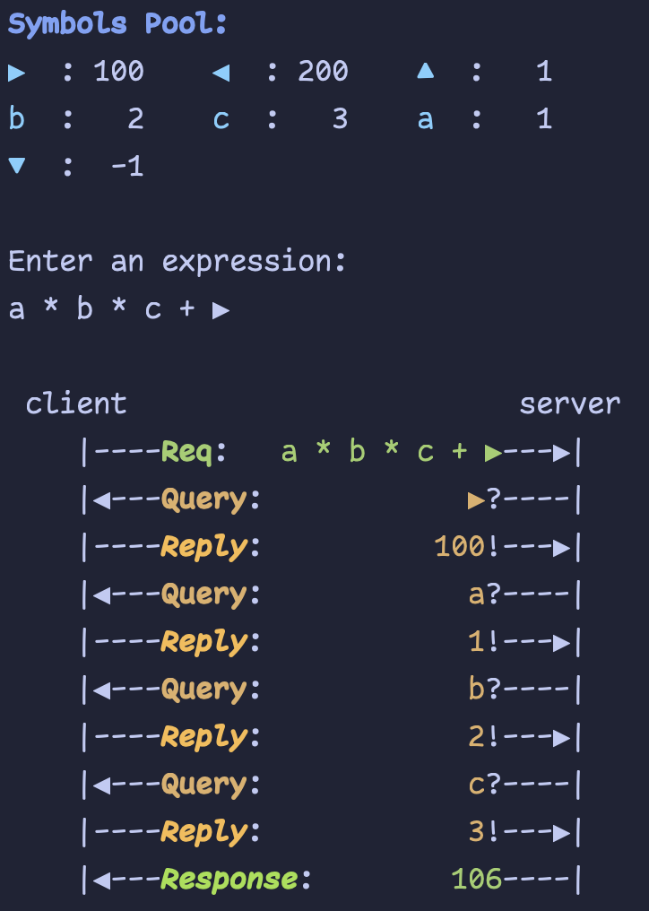

## Stdio RPC

Doing Bidirectional communication over Stdio!

This example demonstrates a bidirectional RPC system over standard input/output:

- The client maintains a set of symbols with their corresponding values.
- The client sends a request to the server to evaluate an arithmetic expression that may contain these symbols.
- The server identifies unknown variables and queries the client for their values.
- The client responds with the required values.
- The server computes the final result and sends it back to the client.

|           Examples            |
| :---------------------------: |
|  |
